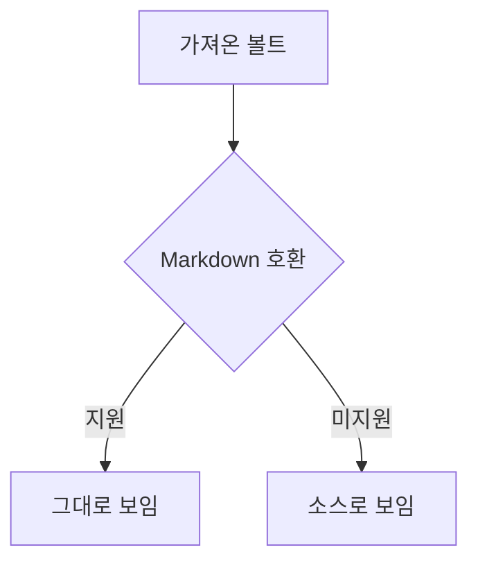

# Mermaid와 각주

```mermaid
flowchart TD
  A[가져온 볼트] --> B{Markdown 호환}
  B -->|지원| C[그대로 보임]
  B -->|미지원| D[소스로 보임]
```

본문 각주[^1]와 이름 각주[^이름], 인라인 각주 ^[인라인 설명]입니다.

[^1]: 첫 번째 각주.
    여러 줄로 이어지는 설명도 보존됩니다.

[^이름]: 이름이 있는 각주.
